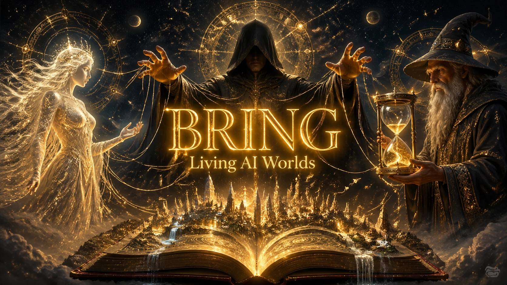

<div align="center">



# 🌌 BRING Project

**B**ackground AI | **R**emembrance | **I**nteractive | **N**arrative | **G**raph

[](#)
[](#)
[](#)

> **BRING** is an advanced, multi-agent framework designed to revolutionize AI-driven role-playing and interactive storytelling. Our mission is to move beyond static chatbots and create a living, breathing, and unpredictable world where AI doesn't just converse with you—it directs, challenges, and immerses you in a deep narrative.

</div>

---

## 📑 Table of Contents
- [The Core Problem](#-the-core-problem-flaws-in-current-llms)
- [Our Solution](#-our-solution-a-living-graph-driven-ecosystem)
- [System Architecture](#-system-architecture-the-tri-layer-design)
- [Technical Status](#-technical-status--architecture)
- [Getting Started](#-getting-started)
- [Contributing](#-contributing)

---

## 🛑 The Core Problem (Flaws in Current LLMs)

Current AI models suffer from two major structural weaknesses when it comes to role-playing and world-building:

1. **Context Degradation & Hallucination:** 
   As conversations grow longer, the AI tends to forget the established rules of the world. It hallucinates facts and ultimately breaks the narrative structure, relying only on the user's most recent prompts.
2. **Passive Storytelling & The "People-Pleasing" Flaw:** 
   Current models are purely reactive. They converse but fail to drive the plot forward. No unexpected events (e.g., sudden family crises, villain attacks, or natural disasters) occur outside the user's direct command. The AI constantly tries to "please" the user, which entirely eliminates tension, challenge, and realism.

---

## 💡 Our Solution: A Living, Graph-Driven Ecosystem

The core philosophy of **BRING** is the implementation of a robust, invisible background framework. Instead of relying on a single AI, we use a synergistic multi-agent system that enforces world logic, generates random events, simulates antagonists, and creates genuine challenges. The user will feel like they are interacting within a living society, not just talking to a machine.

To manage the massive scale of world-building data (such as lore extracted from light novels), information is not stored linearly. Instead, **BRING** utilizes a **Graph-based and Clustered Memory System**. This allows the framework to efficiently manage complex lore and organically inject only the relevant pieces into the narrative exactly when needed.

---

## 🧠 System Architecture (The Tri-Layer Design)

BRING is powered by three distinct LLM agents, each with strictly defined responsibilities, working in unison to craft a flawless narrative:

<details open>
<summary><b>🎭 Layer 1: The Actor (Frontend UI / Interaction LLM)</b></summary>
This is the frontline agent that interacts directly with the user.

- **Role:** Executes the story, role-plays characters, and manages natural, engaging dialogue.
- **Focus:** Tone, expression, and flawless real-time character impersonation.
- **Implementation:** `memory/actor.py` provides `ActorContext` – a point‑in‑time knowledge query for a specific character. *(Full conversational agent loop is under development.)*
</details>

<details open>
<summary><b>🎬 Layer 2: The Director & Antagonist (Background Orchestrator LLM)</b></summary>
The mastermind operating behind the scenes. It oversees Layer 1.

- **Role:** Maintains the overarching narrative structure, enforces world rules, and steers the plot.
- **Special Feature:** This layer actively plays the role of the **Antagonist**. It controls background NPCs, generates sudden plot twists, directs villains, and actively throws the protagonist (the user) into challenging situations to keep the story thrilling.
- **Implementation:** `memory/director.py` provides `Director` – fetches narrative context (current state + relevant history) and injects antagonist events into the timeline.
</details>

<details open>
<summary><b>⏳ Layer 3: The Chronicler (Timeline & Memory LLM)</b></summary>
A vital agent dedicated to preventing chronological chaos in long-term memory.

- **Role:** Meticulously logs major events and maintains a strict chronological Timeline.
- **Focus:** Prevents temporal paradoxes (e.g., ensuring an event from 10 years ago isn't confused with something that happened last week) and guarantees the narrative's historical consistency.
- **Implementation:** `memory/chronicler.py` implements a **bi‑temporal graph** using Graphiti + Kuzu. It can log events and answer queries like “what was known at story time T” with precise date filters.
</details>

---

## 🛠 Technical Status & Architecture

The project is being developed with a strict adherence to **Clean Code** principles and a highly **modular** design.

### ✅ Completed Modules

| Module | Path | Description |
| :--- | :--- | :--- |
| **LLM Gateway** | `llm_gateway/` | Async‑first LLM abstraction with caching, retries, structured output (Instructor), and multi‑provider support. |
| **Memory Engine** | `memory/engine.py` | Lifecycle, bulk episode ingestion, and search orchestration using Graphiti. |
| **Graph Wrapper** | `memory/graph.py` | Initialises Kuzu embedded database, sets up Graphiti with custom LLM/embedder adapters. |
| **Ontology** | `memory/ontology.py` | Pydantic models for entities (`Character`, `Location`, `Event`) and edges (`Knows`, `LocatedAt`). |
| **Extraction** | `memory/extraction.py`| Uses Instructor to turn episode text into typed entities & edges respecting the ontology. |
| **Bi‑temporal** | `memory/chronicler.py`| Logs events with story time, queries state at any moment, returns sorted timeline. |
| **Agent Contexts**| `memory/actor.py` <br> `memory/director.py` | Point‑in‑time knowledge retrieval and narrative context providers. |
| **Maintenance** | `memory/maintenance.py`| Episode deduplication, search result normalisation, TTL‑based query cache. |

### 🔧 Tech Stack & Foundation

- ⚡ **`any-llm`** + **`instructor`** – Seamless integration with multiple LLM providers and guaranteed structured outputs.
- 🗄️ **`graphiti-core`** + **`kuzu`** – Embedded graph database with bi‑temporal capabilities (memory backbone).
- 🛡️ **`pydantic`** – Type‑safe data models for ontology and configuration.
- 🔄 **`tenacity`** – Retry logic for transient LLM errors.
- 🧮 **`tiktoken`** – Token counting and cost estimation.
- 🚀 **Asynchronous Design** – Built completely with `asyncio` to prevent latency bottlenecks.

### 🚧 Work in Progress

- [ ] **Full Agent Loops:** Director and Actor provide memory tools but lack autonomous conversational loops.
- [ ] **Observer / Graphiti Cluster:** Currently using embedded Kuzu; distributed mode planned.
- [ ] **CLI / API:** No UI yet; consumable as a Python library.
- [ ] **Production Embedding Fallback:** Placeholder resilience for failed vector embeddings.

---

## 🚀 Getting Started

### Installation
```bash
# Clone the repository
git clone https://github.com/your-org/BRING.git
cd BRING

# Install dependencies 
pip install any-llm instructor graphiti-core kuzu pydantic tenacity tiktoken openai anthropic cohere
```

### Configuration

Create an `.llm_gateway.env` file (or set environment variables) in the root directory:
```bash
ini
LLM_PROVIDER=openai
LLM_MODEL=gpt-4o-mini
LLM_API_KEY=your_key_here
LLM_EMBEDDING_MODEL=text-embedding-3-small
LLM_EMBEDDING_DIM=1536
```
---

## 🤝 Contributing

We are always open to new ideas, feedback, and contributions from the community! The development of further modules (including the full agent orchestration and user interface) is actively underway.

<div align="center">
  <i>Built with ❤️ to elevate the paradigm of AI storytelling.</i>
</div>
